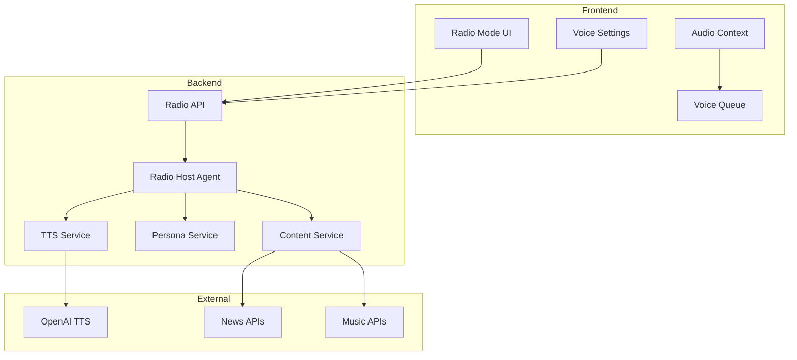

# Radio Mode Architecture Design

## System Overview



## Component Details

### 1. Radio Host Agent State Machine

```python
class RadioHostState(TypedDict):
    mode_enabled: bool
    current_persona: PersonaConfig
    last_spoke_at: float
    tracks_since_last: int
    next_content_type: ContentType
    voice_queue: List[VoiceSegment]
    user_preferences: UserPreferences
```

### 2. Content Generation Pipeline

```
Track Change Event
    ↓
Check Timing Rules
    ↓
Analyze Context (mood, energy, transitions)
    ↓
Select Content Type
    ↓
Generate Script (LLM)
    ↓
Apply Persona Voice
    ↓
Generate Audio (TTS)
    ↓
Queue for Playback
```

### 3. Voice Timing Algorithm

```python
def should_speak(state: RadioHostState) -> bool:
    # Base rules
    if not state.mode_enabled:
        return False
    
    time_since_last = time.time() - state.last_spoke_at
    
    # Minimum silence period (60s)
    if time_since_last < 60:
        return False
    
    # Track-based trigger (every 2-3 tracks)
    if state.tracks_since_last >= random.randint(2, 3):
        return True
    
    # Time-based trigger (every 5 minutes max)
    if time_since_last >= 300:
        return True
    
    # Energy shift detection
    if detect_energy_shift():
        return True
    
    # Random chance (5%)
    return random.random() < 0.05
```

### 4. Audio Ducking System

```typescript
class AudioDucker {
    private targetReduction = 0.3; // 30% volume
    private fadeTime = 500; // 500ms fade
    
    async duckForVoice(voiceDuration: number) {
        // Fade music down
        await this.fadeVolume(1.0, this.targetReduction, this.fadeTime);
        
        // Wait for voice
        await sleep(voiceDuration);
        
        // Fade music back up
        await this.fadeVolume(this.targetReduction, 1.0, this.fadeTime);
    }
}
```

### 5. Persona Configuration Schema

```typescript
interface PersonaConfig {
    id: string;
    name: string;
    description: string;
    voice: {
        model: 'tts-1' | 'tts-1-hd'; // OpenAI TTS models
        voice: 'alloy' | 'echo' | 'fable' | 'onyx' | 'nova' | 'shimmer'; // Available voices
        speed: number; // 0.25 - 4.0 (default 1.0)
    };
    personality: {
        tone: 'warm' | 'energetic' | 'playful' | 'asmr';
        emotional_range: 'chill' | 'balanced' | 'hype';
        character_style: string; // How the persona speaks
        quirks: string[];
    };
    content: {
        topics: string[]; // Preferred topics
        intro_style: string;
        sign_off_style: string;
        fact_categories: string[];
    };
}
```

### 6. Content Templates

```python
TEMPLATES = {
    "track_intro": [
        "Coming up: {track} - a {mood} journey at {bpm} BPM.",
        "Next in line: {artist} with {track}. {energy_comment}",
        "Switching gears to {track}. {transition_comment}"
    ],
    "encouragement": [
        "Quick shout-out - you're crushing it today!",
        "Keep that momentum rolling, friend.",
        "Remember to take a breath and enjoy the moment."
    ],
    "trivia": [
        "Fun fact: {artist} recorded this in {location}.",
        "Did you know? This track samples {original}.",
        "Music history: {genre} originated in {year}."
    ],
    "good_news": [
        "Positive vibes update: {headline}",
        "Something good happening: {news}",
        "Bright spot of the day: {story}"
    ]
}
```

## API Design

### Endpoints

```yaml
/radio/enable:
  method: POST
  body:
    persona_id?: string
    custom_settings?: PersonaConfig
  response:
    status: enabled
    active_persona: PersonaConfig

/radio/voice-segment:
  method: GET
  query:
    track_id: string
    context: PlaybackContext
  response:
    segment: VoiceSegment | null
    audio_url?: string

/radio/feedback:
  method: POST
  body:
    segment_id: string
    rating: 'like' | 'dislike'
    reason?: string

/radio/persona/generate:
  method: POST
  body:
    mood: string
    preferences: UserPreferences
  response:
    persona: PersonaConfig
```

## Database Schema

```sql
-- Radio sessions
CREATE TABLE radio_sessions (
    id INTEGER PRIMARY KEY,
    user_id TEXT,
    started_at TIMESTAMP,
    ended_at TIMESTAMP,
    persona_id TEXT,
    total_segments INTEGER,
    user_rating REAL
);

-- Voice segments
CREATE TABLE voice_segments (
    id INTEGER PRIMARY KEY,
    session_id INTEGER,
    content_type TEXT,
    script TEXT,
    audio_url TEXT,
    played_at TIMESTAMP,
    user_feedback TEXT,
    FOREIGN KEY (session_id) REFERENCES radio_sessions(id)
);

-- Persona analytics
CREATE TABLE persona_usage (
    persona_id TEXT,
    usage_count INTEGER,
    avg_session_length REAL,
    avg_rating REAL,
    last_used TIMESTAMP
);
```

## Security & Performance

### Caching Strategy
- Cache generated TTS audio for common phrases
- Store persona configurations locally
- Pre-generate content during idle time

### Rate Limiting
- TTS API: Max 100 requests/minute
- Content generation: Throttle to avoid costs
- News API: Respect third-party limits

### Privacy
- No storage of personal conversation data
- Anonymous usage analytics only
- Opt-in for advanced features

## Testing Strategy

### Unit Tests
- Persona configuration validation
- Content template rendering
- Timing algorithm accuracy

### Integration Tests
- TTS service reliability
- Audio ducking synchronization
- API endpoint functionality

### E2E Tests
- Full radio session flow
- Voice customization workflow
- Error recovery scenarios